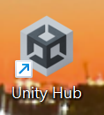
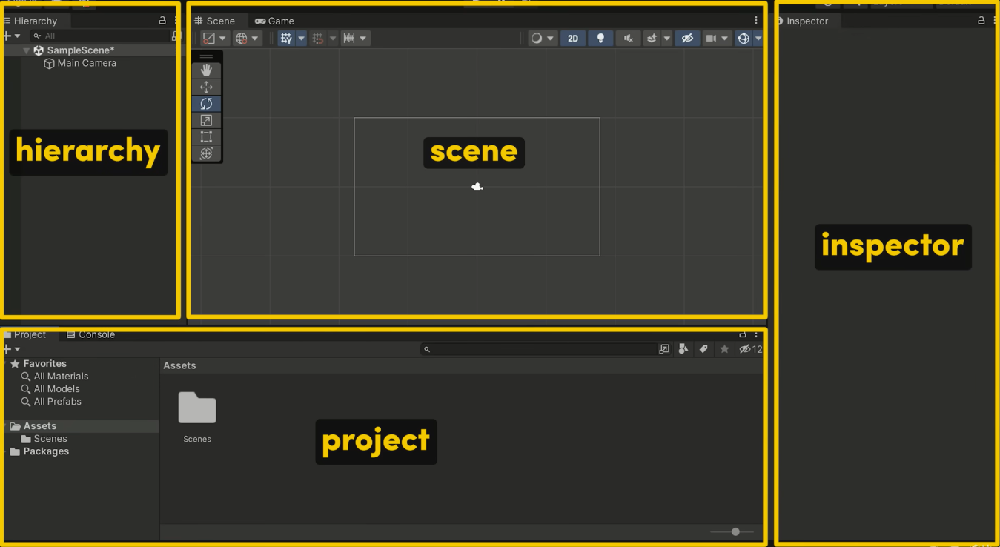

# Entry 1: Deciding a Tool and Tinkering with it to create a 3D game (Bowling)
##### 11/10/2025

## Choosing my Tool & What Game I want to make
As I move onto my senior year, I've chosen to take on the APCSA course. Similar to past SEP courses, this year we are also tasked to create a project to present at the end of the year. Inspired by my schools bowling team I've chosen to make a 3D bowling game so that me and others can play even if the bowling season is over. To make this game I will be using the [Unity](https://unity.com/) gaming engine which is the best for creating 3D games. In my first learning log I started by downloading Unity on my personal laptop since it can't be accessed through a school issues laptop. 
Then I began researching different ways Unity can be used and what different gears did by watching [One of the best Unity tutorial videos on youtube](https://www.youtube.com/watch?v=XtQMytORBmM). After watching the video I started clicking around to try and tinker with what I saw and I slowly began to grasp what Unity is about.

* Projects: Import Sprites, Fonts, Music, etc.
* Hierarchy: Everything that's in the scene (Big folder that hlds everything inside). Sets the scene.
* Inspector: Able to move and position the objects in the scene.
* Scene: Shows whats going on. In the Scene we are able to hit play to run any changes we've mad in the hierarchy, inspector, or projects.
## Engineering Design Process (EDP)
I am now in the first stage of the engineering design process. I will be deciding what I want to make for this years freedom project (Game, Website? etc) and choose a tool to help me make it. Next I will be approaching the second stage of the Engineering Design Process where I will be doing some deep dives into how to work my tool.
## Skills
### Searching for videos/tutorials and ways to tinker with my tool
 Searching for videos/tutorials and ways to tinker with my tool was a must have skill for this part of the Freedom project as I found many helpful tutorials on youtube that helped me get a deeper understanding of Unity.

### Time Management
Managing my own time in this part of the freedom project was crucial because I had to make sure that I had enough time to finish my work for other classes and at the same time have time to tinker with my tool. Additionally, I had to focus on my common applications and keep track of various deadlines all at once.
## Next Steps
I am looking forward on continuing on tinkering with [Unity](https://unity.com/) and learning more about what we will get into next!
[Next](entry02.md)

[Home](../README.md)
