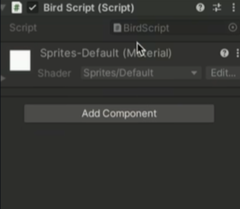
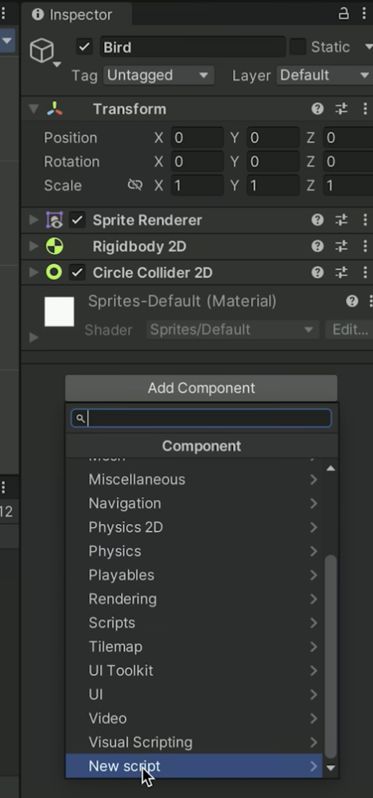

# Entry 2
##### 12/15/2025

## Content
Previously I watched the [best youtube video guide](https://www.youtube.com/watch?v=XtQMytORBmM) about Unity and I began to tinker around with it. In the instector section is where we can move the objects in the scene and add different components like physics and collision.

Additionally in the "Add Components" section I learned that we can add our own scripts which is code that we can code ourselves. This is extremely useful because I will be able to code exactly what I want my scene to do.

However, the dounside is that Unity no longer supports java coding in their script as they've transferred to C# language coding. But thankfully I found lesson on [Free Code Camp](https://www.freecodecamp.org/learn/foundational-c-sharp-with-microsoft/) which I've previously used to learn java and other coding languages which will help me learn C#.

## Engineering Design Process (EDP)
I am now in the second stage of the engineering design proces. I will be doing some deep dives into how to work my tool. Next I will be moving onto creating some prototypes to further practice on using my tool.

## Skills
### Self-learning and research skills
As I continued to tinker with my tools I realized that Unity no longer supports java in it's component system. Unity is now using C# which is a language similar to java but have some changes in it's coding language. Through my research I was able to find C# lessons on Free Code Camp to help me learn and process how the codes work. Through this I stengthened my skills in research and learning.

### Time management
With college applications and everything coming close to the deadlines I had to learn to use my time wisely to complete every assignment and application.M anaging my own time in this part of the freedom project was crucial because I had to make sure that I had enough time to finish my work for other classes and at the same time have time to tinker with my tool. Additionally, I had to focus on my common applications and keep track of various deadlines all at once.
## Next Steps/GOALS
Next we will be approaching the end of the first marking period and time is ticking. Over the break I have several Goals that I want to achieve before we get back:

* Make something very simple with Unity that includes physics, sprits, collisions, and gravity.
* Finish the lessons I found on [Free Code Camp](https://www.freecodecamp.org/learn/foundational-c-sharp-with-microsoft/) to help me learn C# code which is very similar to java.

[Previous](entry01.md) | [Next](entry03.md)

[Home](../README.md)
