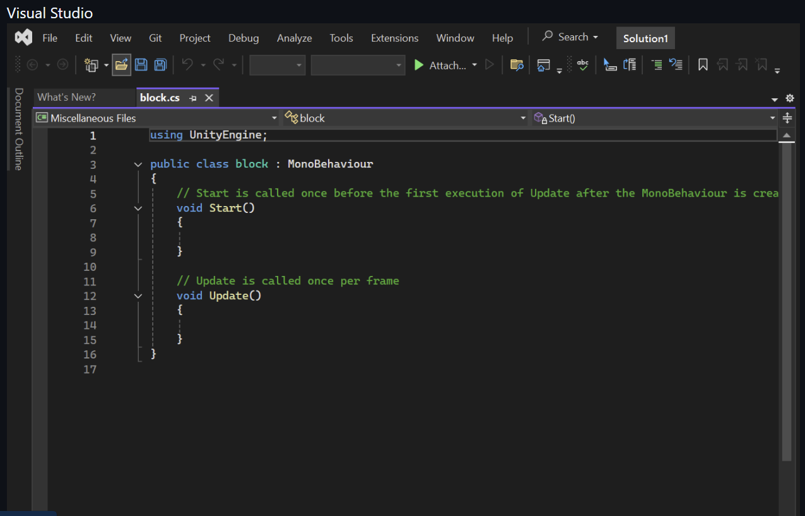
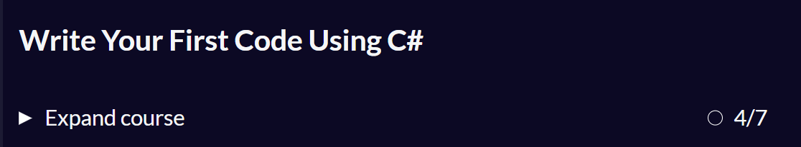
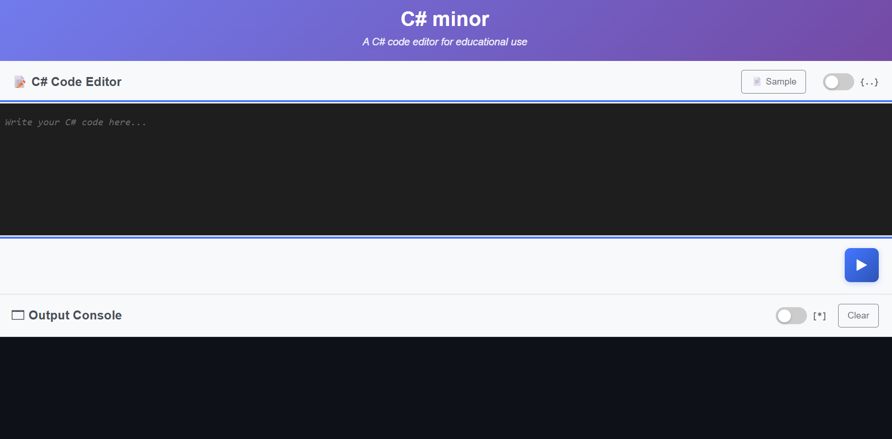

# Entry 3
##### 2/9/2026

## Content

In my last learning log I learned that in Unity they've adapted to C# for most of their projects so I went on [Free Code Camp](https://www.freecodecamp.org/learn/foundational-c-sharp-with-microsoft/) and found free tutorials to learn C#!
 

[FreeCodeCamp](https://www.freecodecamp.org/learn/foundational-c-sharp-with-microsoft/#write-your-first-code-using-c-sharp) were actually using lessons from microsoft to help assist the learning of C# language. 

## Engineering Design Process (EDP)
I am now in the second stage of the engineering design proces. I will be doing some deep dives into how to work my tool. Next I will be moving onto creating some prototypes to further practice on using my tool.

## Skills
### Time management
Time management was once again an important skill to have because while also balancing school work I also had to take out time to learn C# coding and tinker with my tool. As the first semester came to an end time was tight and I had to squeeze in all the time I had into learning my tool and C# coding language.

### Discipline
Discipline was definitley a significant skill to have for this because it's not easy to take out time to go on FCC and learn C#. It took a lot of discipline and time.

## Next Steps/Overall
Overall, I've learned a lot about Unity itself and the C# coding language. Next I'll continue to learn my tool while also start planning out my prototype (MVP)!

[Previous](entry02.md) | [Next](entry04.md)

[Home](../README.md)
