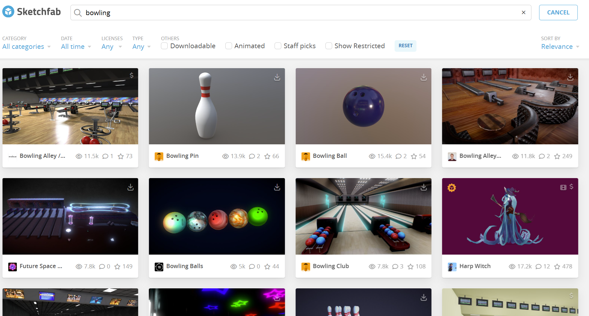
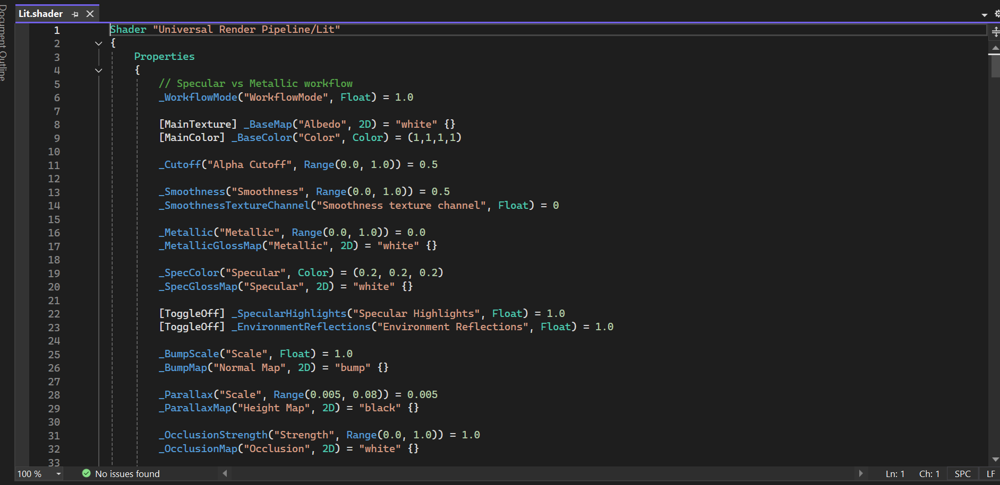

# Entry 4
##### 3/15/26

## Context
Upon finishing my planning for my prototype I am now starting to make and code the game.

Using SketchFab and Object resources in Unity I was able to gather all the sprites I needed for this project.

## Engineering Design Process (EDP)
I am now on stage 5 of the Engineering Design Process where I will begin to create and finalize a prototype of my 3D bowling game project. Then we will start to work on the Beyond MVP of the prototype where I will be adding a full background/map and game audio.

## Skills
* C# Language - Over the course of the past few months I've been able to learn a new coding language: C#. I was able to learn this through Free Code Camp which was a learning tool in both SEP 10&11 this was extremely helpful because I was able to learn the language quickly lesson by lesson. C# is the exact coding language I will need for Unity because it no longer supports java lanuages.

* Time management was once again an important skill to have because while also balancing school work I also had to take out time to learn C# coding and tinker with my tool. As the first semester came to an end time was tight and I had to squeeze in all the time I had into learning my tool and C# coding language.
## Next Steps
Overall, I've finished planning my MVP. Next I will start building my MVP and soon move onlo building the Beyond MVP.

[Previous](entry03.md) | [Next](entry05.md)

[Home](../README.md)
