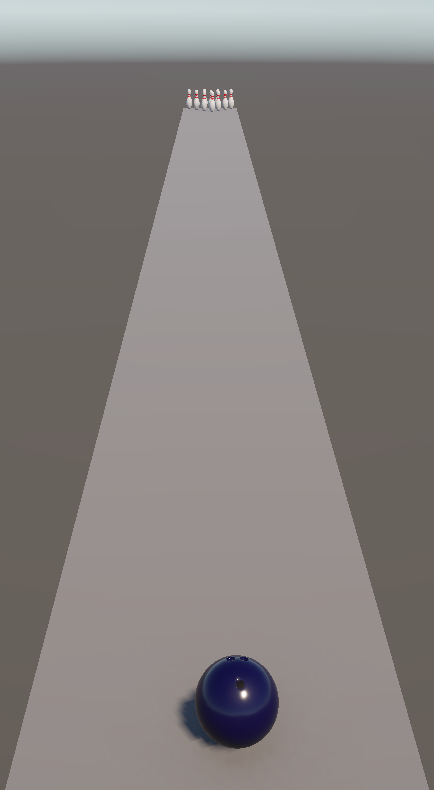
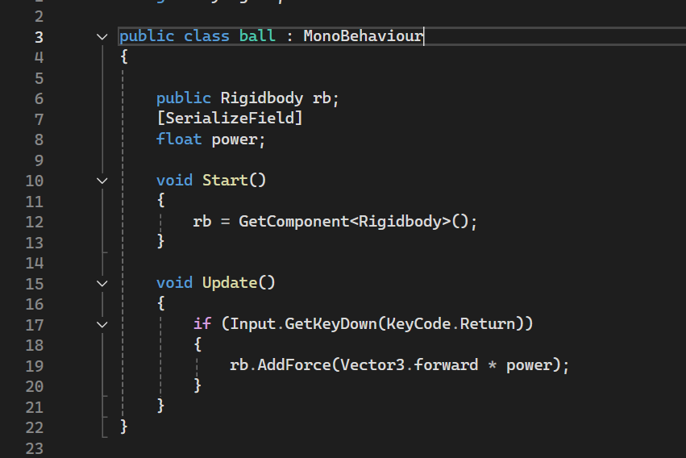

# Entry 5
##### 04/17/2026
## Context
As the final school year comes to an end, the freedom project is also coming to an end. I've finished my MVP which there's still room for improvement before the deadline. Below is an image of what I have right now and later I'll add more graphics to make it look better.

Users are able to play and run the game smoothly however, they're unable to see their scores or any colors so I'll improve on that later on.

This is part of my code which helps the bowling ball roll at a set paste by the coder and not the user (To be changed later). 
## Engineering Design Process (EDP)
I've finished my Freedom Project MVP!! Next I'll approach stage 7 of the EDP where I will be improving what I already have and make a BEYOND MVP.

## Skills
* C# language: Over the course of the past few months I've been able to learn a new coding language: C#. I was able to learn this through Free Code Camp which was a learning tool in both SEP 10&11 this was extremely helpful because I was able to learn the language quickly lesson by lesson. C# is the exact coding language I will need for Unity because it no longer supports java lanuages. As I coded my project I was able to use c# more efficiently overtime.
* Better Understanding of Blender & Sketchfab: Through coding my Unity 3D bowling game I needed to combine [Sketchfab](https://sketchfab.com/3d-models/bowling-alley-floor-texture-0c9eef0c662e4d2a8d0ab7329c245891) and Blender 3D to help me access the 3D models (Bowling ball, pins, lane materials, etc.) I needed for this project. I was able to get a better understanding of how blender works and learned to navigate it on my own without the help of youtube or google seaches.

## Next steps & Overall
Overall, I've finished my MVP. However, there's still a lot to work on to make my bowling game more appealing and fun for the users to play. Next, I'll begin to develop my BEYOND MVP where I'll add more physics components so that users can curve the ball and a scoring system + Music.

[Previous](entry04.md) | [Next](entry06.md)

[Home](../README.md)
