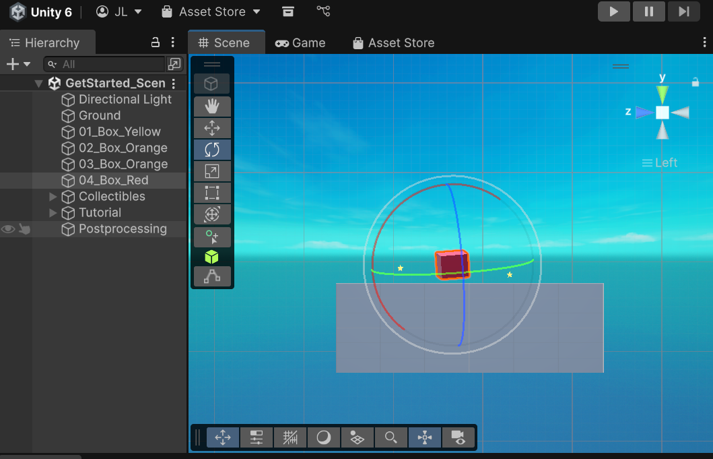
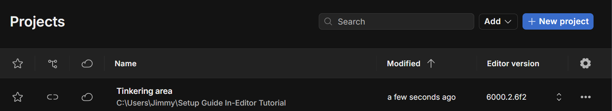

# Tool Learning Log

## Tool: **Unity**

## Project: **3D Bowling**

---

### 10/4/25:
* Downloaded and installed the latest version of Unity/Unity Editor.
* Created an account using personal email
* How do I get started?
* Began searching on google and youtube

### 10/5/25:
* I watched [One of the best Unity tutorial videos on youtube](https://www.youtube.com/watch?v=XtQMytORBmM) to start off with after I've completely finished downloading and setting up Unity.

### 10/29/25
* Downloaded visual studio (2022) from unity that will be needed for my 3D bowling game.

### 11/1/25
* Continued watching the video from 10/5 to recap what the different buttons do in the unity project page.
* Started clicking around.
* Question: How do I start adding visuals and create a map for my game? How will I control the camera based on acceleration etc?

### 11/16/25
* Exploring the assets store and the different concepts of the unity game engine (Rotation, cameras, shape, etc.).

* Setting up different project folders for tinkering & main.

* Things to note
 * Remeber to press save after every edit before exiting
 * There's nothing free in the assets store
 * Very laggy with multiple tabs open
* Next Steps/Plans
 * Learning how to import or utilize sprints in Unity
 * Potentially import different sprits and test with the physics mechanisms
 * Start building/finding assets by the end of december.

<!--
* Links you used today (websites, videos, etc)
* Things you tried, progress you made, etc
* Challenges, a-ha moments, etc
* Questions you still have
* What you're going to try next
-->
