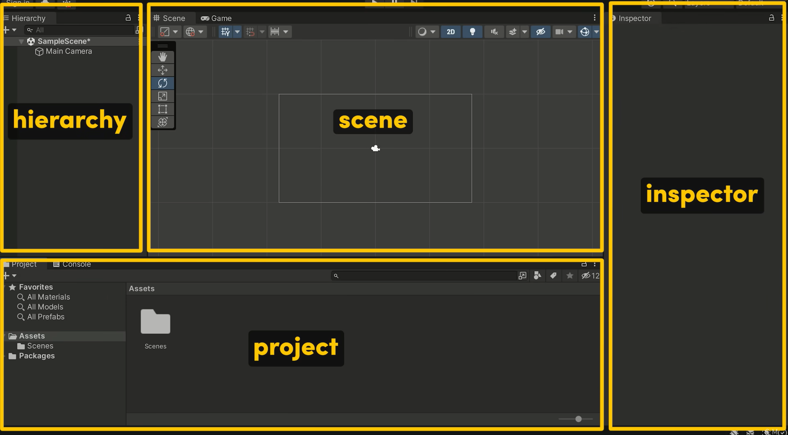
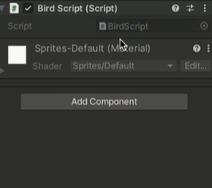
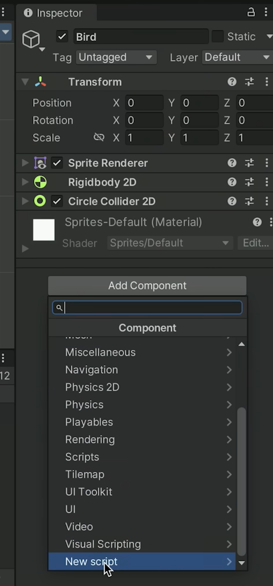
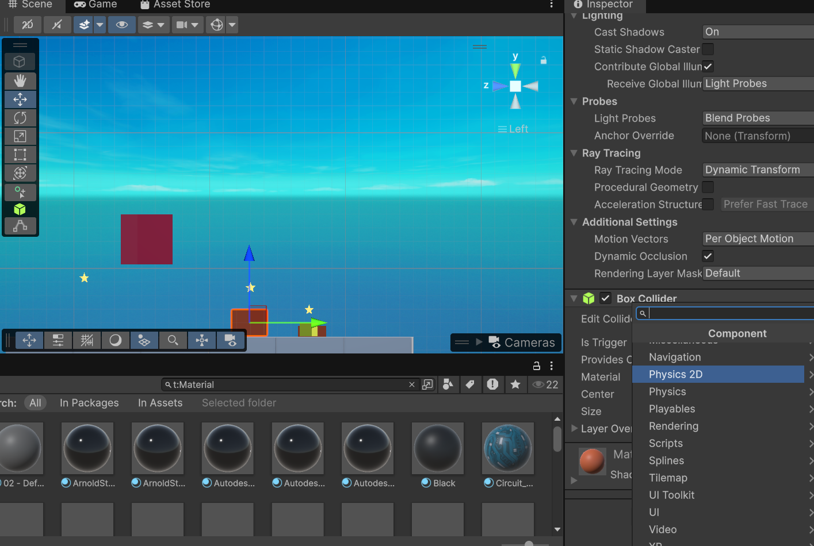
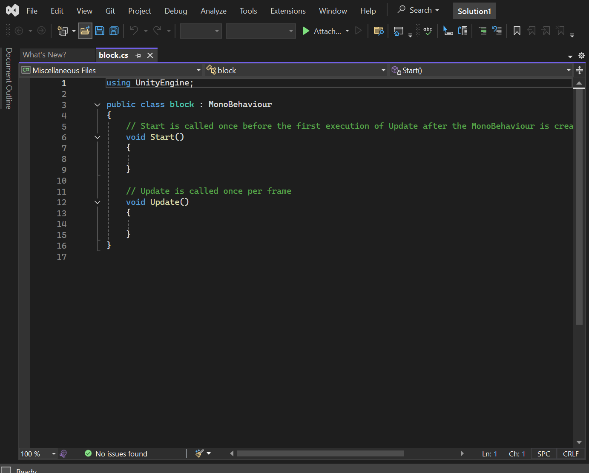

# Tool Learning Log

## Tool: **Unity**

## Project: **3D Bowling**

---

### 10/4/25:
* Downloaded and installed the latest version of Unity/Unity Editor.
* Created an account using personal email
* How do I get started?
* Began searching on google and youtube

### 10/5/25:
* I watched [One of the best Unity tutorial videos on youtube](https://www.youtube.com/watch?v=XtQMytORBmM) to start off with after I've completely finished downloading and setting up Unity.

### 10/29/25
* Downloaded visual studio (2022) from unity that will be needed for my 3D bowling game.

### 11/1/25
* Continued watching the video from 10/5 to recap what the different buttons do in the unity project page.
* Started clicking around.
* Question: How do I start adding visuals and create a map for my game? How will I control the camera based on acceleration etc?

### 11/16/25
* Exploring the assets store and the different concepts of the unity game engine (Rotation, cameras, shape, etc.).

* Setting up different project folders for tinkering & main.

* Things to note:
 * Remember to press save after every edit before exiting
 * There's nothing free in the assets store
 * Very laggy with multiple tabs open
* Next Steps/Plans:
 * Learning how to import or utilize sprints in Unity
 * Potentially import different sprits and test with the physics mechanisms
 * Start building/finding assets by the end of december.

### 11/23/25
###### The different components of Unity

* Projects: Import Sprites, Fonts, Music, etc.
* Hierarchy: Everything that's in the scene (Big folder that hlds everything inside). Sets the scene.
* Inspector: Able to move and position the objects in the scene.
* Scene: Shows whats going on. In the Scene we are able to hit play to run any changes we've mad in the hierarchy, inspector, or projects.

* Additionally, to add a custom component to our scene we can use the add component whcih we will have to code ourselves. Using the inspector we can select the sprite we want and add physics and collision to the sprite.

### 12/7/25

* In Unity if we want to create our own program we would need to navigate to the inspector and go down to click **new script**. However, code would need to be written in C# language as new unity projects no longer support javascript in its systems.
* The script is unable to access other components of the game object as it would have to creat lines of communication like a network.
* Both C# and Java have similarities it's just the code is written slightly different.

12/14/25

* Playing around with the different components of Unity.

Visual Studio

* Similar to IDE linking to my GitHub account

* In my last learning log I learned that in Unity they've adapted to C# for most of their projects so I went on [Free Code Camp](https://www.freecodecamp.org/learn/foundational-c-sharp-with-microsoft/) and found free tutorials to learn C#!

<!--
* Links you used today (websites, videos, etc)
* Things you tried, progress you made, etc
* Challenges, a-ha moments, etc
* Questions you still have
* What you're going to try next
-->
